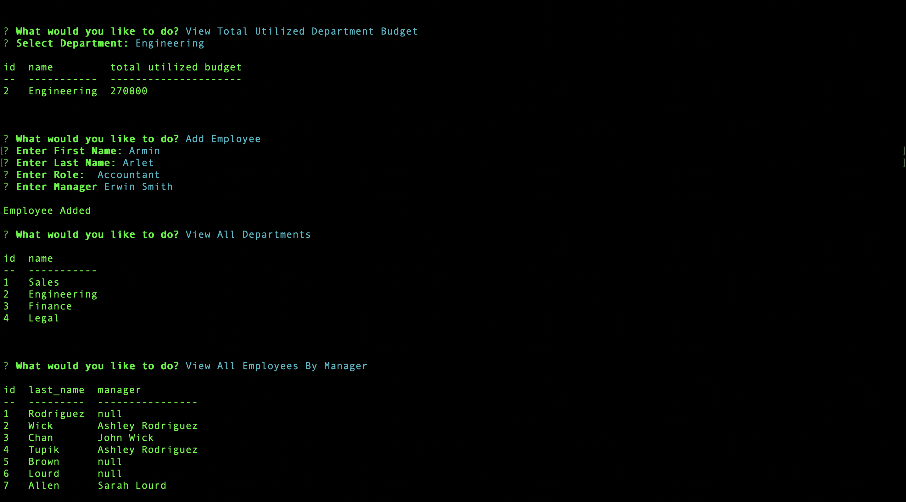

# Employee Tracker using Node.js MySQL and Inquirer

## Author
Edward Reyes

## Tables of Contents

* [Description](#description)

* [Installation](#installation)

* [Usage](#usage)

* [Challenges](#challenges)

* [Demo](#questions)

## Description

This app is an **C**ontent **M**anagement **S**ystems built with Node.js. 

Design the following database schema containing three tables:
* **department**:

  * **id** - INT PRIMARY KEY
  * **name** - VARCHAR(30) to hold department name

* **role**:

  * **id** - INT PRIMARY KEY
  * **title** -  VARCHAR(30) to hold role title
  * **salary** -  DECIMAL to hold role salary
  * **department_id** -  INT to hold reference to department role belongs to

* **employee**:

  * **id** - INT PRIMARY KEY
  * **first_name** - VARCHAR(30) to hold employee first name
  * **last_name** - VARCHAR(30) to hold employee last name
  * **role_id** - INT to hold reference to role employee has
  * **manager_id** - INT to hold reference to another employee that manager of the current employee. This field may be null if the employee has no manager

The app allows the user to:

  * Add departments, roles, employees

  * View departments, roles, employees

  * Update employee roles

  * Update employee managers

  * View employees by manager

  * Delete departments, roles, and employees

  * View the total utilized budget of a department -- ie the combined salaries of all employees in that department

## Installation

To install the necessary dependencies, run the following command:

```
npm i
```

## Usage

To start the program: 

```
node index.js
```

## Challenges

My biggest challenge was managing all the asynchronous functions. There were times where I wasn't using async functions properly, like
using the keyword 'await' on a function that doesn't return a promise. I had to review how promises worked and how to utilize them in order
to get the desired data for some the inquirer prompts. But once I understood how to use async functions along with promises I was able to
progress smoothly.

## Demo 
Here's a video of The Employee Tracker in action: [EmployeeTrackerDemo](https://www.youtube.com/watch?v=C0KIq9OwxxA&feature=youtu.be)



